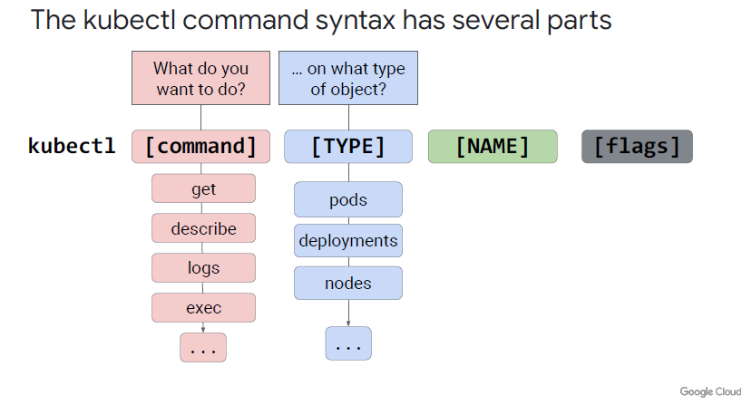

# kubectl Notes 

C'est le CLI pour intéragir avec un cluster k8s. Il passe par les API (kube-APIserver du Control plane).

## Config
* Config file in $HOME/.cube/configs
* View config : `kubectl config view`

## Nodes
Serveurs d'un cluster k8s où on déploie les pods.
- Voir les pods d'un cluster : `kubectl get nodes $CLUSTER_NAME`

## Pods
Le plus petit objet déployable. Un pod peu contenir 1 ou plusiers containeurs. Les conteneurs d'un pod partagent le même réseau et le même stockage. 
* Liste des pods : `kubectl get pods`
* Se connecter a un Pod: `kubectl exec -it $POD_NAME -- sh`

## Déploiements
- Voir un déploiement: `kubectl get deployments $DEPLOYMENT_NAME`

- apply : `kubectl apply -f ./nginx-deployment.yaml`
- scale : `kubectl scale --replicas=3 deployment nginx-deployment`
- rollout: 
  * kubectl set image deployment.v1.apps/nginx-deployment nginx=nginx:1.9.1
  * kubectl rollout status deployment.v1.apps/nginx-deployment
  * kubectl rollout history deployment nginx-deployment
  * kubectl rollout undo deployments nginx-deployment
- delete

## Services
- kubectl get service $SERVICE_NAME
- 

## Persistent Volume
kubectl get persistentvolumeclaim
